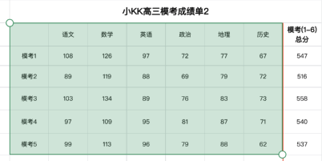
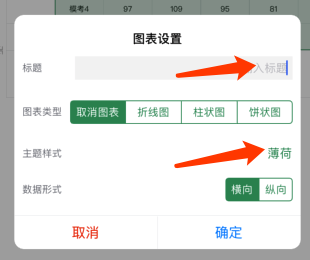
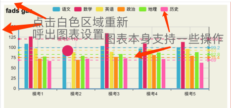
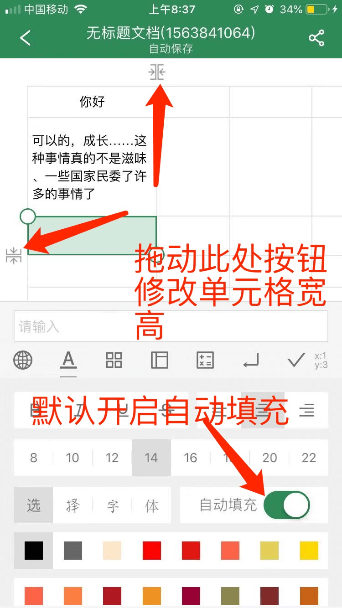

##  在其他应用打开excel文件，选择其他应用打开，选择表格制作器，即可导入打开并且编辑该文件。
##  同时也可以在应用“新建”页面导入excel文件，选择本地excel文件导入。
[计算功能图解](https://www.jianshu.com/p/5e5214d03224)

### 图表功能的使用
* 1.20版本之后新增图表功能，主要包括折线图、柱状体、饼状图。
* 第一步，选中区域

* 第二步，轻触绿色区域，弹出菜单之后选择图表
* 第三步，在弹出的图表设置框中进行图表设置操作

    + 支持设置图表标题。
    + 支持设置图表类型，『取消图表』为不设置图表，直接展示表格数据。
    + 支持选择主题，包括14种主题，具体样式可以自行去尝试使用。
    + 数据形式选择，默认为横向，也即以竖为单位进行排布。具体可以两者都试一下，更快达到想要效果。
    + 图表设置之后，点击边框附近可以重新设置或者取消图表等。
    + 图表提供一些交互操作，比如点击标题可以隐藏/显示单条数据、具体可自行尝试，较简洁。
    

### 可以自主修改单元格宽高

* 如左右拖动响应不便，可以手指放在拖动按钮上，再往下滑动之后再左右滑动。
### 计算功能说明
* 计算功能只允许选中单个单元格，选中之后，进行计算设置。
* 我们的计算功能设计非常简单，选中之后都会在下方有当前设计文字提示，可根据文字提示进行操作。
### 复制粘贴和批量插入内容
* 选中单元格之后，轻触绿色区域，即可弹出相关操作。
* 可以对当前选中的多个单元格进行批量插入、删除内容。
* 比如我们需要在表格第一排插入日期从“7月1号”到“7月31号”可以进行如下操作
    + 选中需要插入的单元格
    + 点击蓝色区域，选择批量插入
    如图所示操作

### 使用小技巧
下面介绍一下使用小技巧
* 在多设备使用时，有时候我们需要手动点击设置页面的“主动同步”按钮进行同步操作。
* 当有多条数据下载时，可能需要多次点击主动同步，才能更加完整显示数据。
* 我们仍然在积极优化它，之后会增加更多有趣的可玩性功能。

### 联系我们
* Email:xiaochengkejis@foxmail.com
* 联系QQ:183051883
